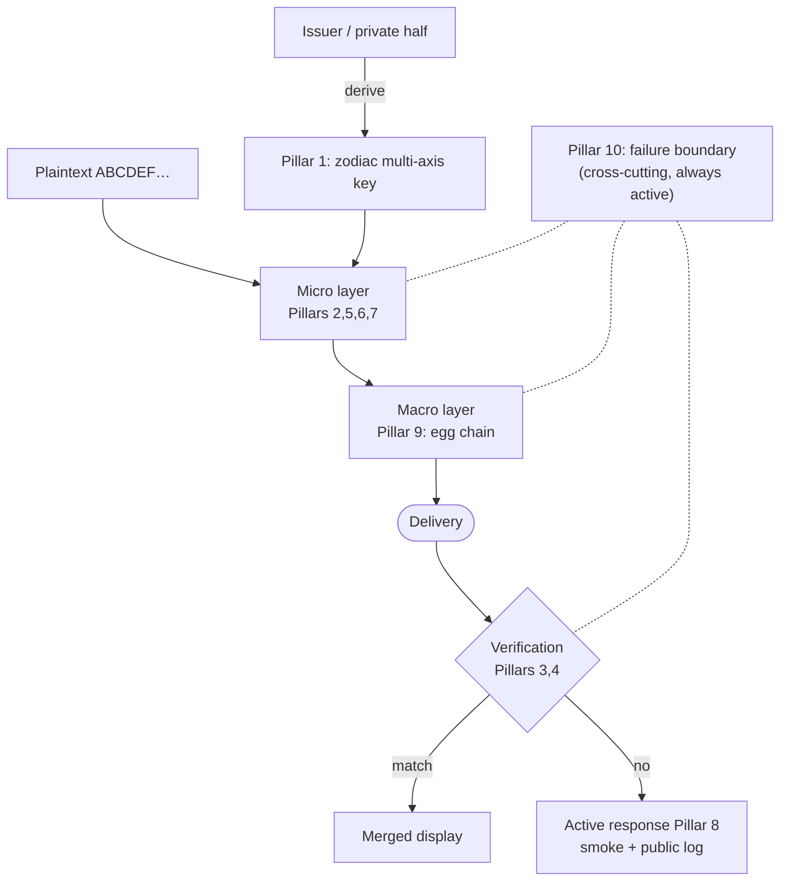

<!--
  human cord — Concept White Paper v0.2 (English edition / deliverable)
  Parallel translation of docs/whitepaper-v0.2.ja.md.
  External reviewer distribution. Internal cross-references removed.
-->

# human cord

### An Infrastructure Where Lies Cannot Hide
#### A Cryptographic Infrastructure for Documentary Integrity in the AI Era

|  |  |
|---|---|
| **Version** | v0.2 (preliminary draft) |
| **Date** | 2026-05-29 |
| **Author** | ⟨full legal name — to be inserted just before Phase 3 publication⟩ |
| **Affiliation** | Independent project (unaffiliated; belongs to no company or organization) |
| **Status** | Phase 0 (design documentation) complete / Phase 1 (minimal POC) all 10 pillars reached / Phase 2 (physical layer) Pillar 7 protocol layer started |
| **Contact** | ⟨email address — to be inserted just before Phase 3 publication⟩ |
| **License** | Text: Creative Commons Attribution-ShareAlike 4.0 International (CC BY-SA 4.0) Associated code: Apache License, Version 2.0 |

---

## 1. Abstract

As the capabilities of generative AI advance, the cost of superficially reproducing official documents and certificates is falling rapidly. EUF-CMA-secure digital signatures already achieve existential unforgeability — "no valid signature can be produced without the issuer's secret" — and detect tampering. What this white paper sets out to fill is the gap that remains beyond that: (a) holding that guarantee **intrinsically in the document body and the physical medium rather than in a detached signature**, (b) **issuer-mediated verification in which only the issuer judges authenticity while the body stays hidden** (composable with public-key public verification), and (c) intrinsic features that public-key signing alone cannot provide (confidential matching, threshold issuance, physical carriers). The human cord proposed in this white paper is a concept for an integrated cryptographic infrastructure that fills this gap.

human cord integrates **10 pillars** into **five domains plus one cross-cutting layer**: (i) the macro layer (the egg chain), (ii) the micro layer (the contents of each egg), (iii) the key-derivation layer, (iv) the verification layer, (v) the active-response layer, and (vi) the cross-cutting failure-boundary layer. Each pillar is, on its own, strongly connected to existing research and standards; rather than reinventing the wheel, the novelty lies in how they are combined. We present three principal contributions (claims at the conceptual level; the current POC is at a minimal-implementation stage). First, a Subliminal Channel extended to the document level (Pillar 6; the **true subliminal channel — Simmons's original construction that embeds the covert message in the signature's nonce — is implemented** [6-ii, `simmons.js`], while the separate-field variant [6-i] is an issuer-only authenticated side-payload and the document-level eye-glyph embedding remains future work). Second, self-observation resistance that rigorously separates "form" from "secret" at the failure boundary (Pillar 10). Third, the tally operators `+/−` (Pillar 3), a **design frame that unifies them into one operator algebra and branches automatically on verification failure** (mechanisms such as BLS aggregate signatures are designed as a replaceable boundary; the current POC minimally implements the tally property with dependency-free HMAC).

As mid-to-long-term standardization goals, we have ISO/IEC 18033 (encryption algorithms), the annexes of ISO/IEC 27002 (controls), and IETF RFCs (via the IRTF CFRG) in view. At the time of writing, Phase 0 (design documentation) is complete, and in Phase 1 (a minimal Node.js POC) all ten pillars have reached implementation.

---

## 2. Motivation: Why a Mechanism, Not People, Should Guard the Truth

### 2.1 The Problem We Set Out to Solve

The outward appearance of official documents and certificates is becoming easy to reproduce by combining large language models with image-generation models. An EUF-CMA signature already guarantees that "no valid signature can be produced without the issuer's secret," yet such a signature is **detached** from the document — it can be stripped or swapped — and it makes issuer-identity depend on PKI's binding of public key to identity. What we aim for is to hold that guarantee **intrinsically** in the document body and physical medium, and to provide a **confidential verification** in which only the issuer judges authenticity while the body stays hidden, together with **public verification** by public key. Blockchains are strong at making public records tamper-resistant, but they are not a technology for embedding issuer-identity inside the document itself; the two should be complementary.

### 2.2 The Project Constitution (Three Principles)

human cord holds, prior to any technical design, three principles as its constitution. First, build a **mechanism where lies cannot hide**: rather than preventing tampering outright, prioritize that the moment tampering occurs, a trace remains and persists. Second, create **a state in which rules are observed, rather than asserting rights**: instead of "rights-assertion" mechanisms such as access restriction, copy protection, and automatic reporting, aim for "rule-compliance" infrastructure in which anyone can judge authenticity. Third, **AI is AI and people are people** — rather than fighting, each fulfills its own role.

### 2.3 The Fourth Article: Separation of Technology, Law, and Ethics

Technology devotes itself to preserving truth; the role of punishing malice is left to law, and the role of choosing what is right is left to ethics. human cord merely raises smoke; judging that smoke belongs to the domain of people and law. We make explicit, as a premise of our design decisions, that technology **must not replace** law or ethics.

### 2.4 Three Gaps Existing Countermeasures Leave Open

First, a signature is **detached** from the document and can be stripped or swapped, so the guarantee cannot be held intrinsically in the document body or physical medium, and issuer-identity depends on the public-key-to-identity binding of PKI operations. Second, cryptographic evidence is lost across media round-trips such as printing, scanning, and photography. Third, internal structure is exposed at the moment of failure (the lack of a systematic countermeasure against side-channel and fault attacks). The ten pillars presented here address these three gaps head-on through Pillars 4, 7, and 10 respectively.

### 2.5 Threat Model, Attacker Capabilities, and Trust Boundary

The attacker assumed in this paper can perfectly reproduce a document's outward appearance (generative AI), can observe, record, and re-present communications, and can interpose physical media such as printing, photographing, and scanning. What the attacker does **not** hold is the issuer's secret (the issuer's half of the symmetric codebook, and the signing secret of the public-key layer) — this is the root of trust.

The trust boundary differs across the two modes. **Issuer-mediated verification (§3.4(i)) is a centralized model that presupposes a trusted party holding the issuer secret (a server)**; authenticity judgment depends on that secret-holder. **Public verification (§3.4(ii), Ed25519), by contrast, needs no server for verification itself** — but the **authentic distribution of the issuer's public key (key trust)** is out of scope here and must be assured separately by a certificate chain, a key-transparency log, or the like.

We state the impact of key compromise explicitly. If the issuer secret leaks, issuer-mediated verification of the symmetric core is fully broken (the attacker can produce cords that look legitimate); if the public-key layer's signing secret leaks, attestations for public verification can be forged. However, key advancement (Pillar 5) prevents retroactive decryption of previously issued material even if the current state leaks (forward secrecy). The premise throughout is that the secret remains, always, in the issuer's private half.

As an honest reduction, we add: Pillar 1's multi-axis key reduces essentially to "HKDF domain separation of a public salt + a secret IKM," and the "multi-axis" semantics of zodiac and clock are merely public nonces/salts for reproducing verification (a naming metaphor). Pillar 5's ratchet is a stream/session-oriented notion; applied to a single certificate it is insurance for forward secrecy and can be overkill.

### 2.6 Known Limitations / Non-goals

**Non-goals.** Technology devotes itself to "raising smoke" (leaving a trace of tampering) and does not address access restriction, copy protection, automatic reporting, or the punishment of malice (§2.3). The authentic distribution of the issuer's public key (PKI / key transparency), and any guarantee of real-device round-trip performance for physical media, are likewise out of scope.

**Known limitations (POC stage).**

- The current POC is dependency-free. Pillar 3's tally is an HMAC pass-token, with BLS aggregate signatures designed as a replaceable future mechanism boundary. Pillar 4b is two-layered: in addition to 4b-i (Shamir distributed storage that gathers k shares at issuance and **reconstructs the secret once before sealing**), **4b-ii implements a true threshold signature in which each share partially signs without ever reconstructing the secret (a prime-field threshold Schnorr, `threshold.js`)** (residual limits: single-nonce/sequential only, trusted dealer, VSS future, non-constant-time). Pillar 6 is likewise two-layered: in addition to 6-i (a separate authenticated side-payload — not strictly a subliminal channel), **6-ii implements a true Simmons subliminal channel embedded in the signature's nonce (`simmons.js`)** (residual limits: broadband — the receiver shares the signing key — and passive-warden only). BLS, DKG, the narrowband variant, and eye-glyph embedding remain future work.
- The self-made GF(256)/Reed-Solomon of the Pillar-4 family (`shard.js`/`ecc.js`) and the self-implemented tally are verified for functional correctness, but their **constant-time behavior and side-channel resistance are not guaranteed and not externally audited**; production adoption requires replacement with constant-time implementations / audited libraries. The symmetric core that carries document confidentiality (AEAD, key derivation, public-key signing) uses a standard library (node's standard crypto) and is outside this reservation.
- Pillar 7's physical carrier is demonstrated to recover not only after a synthetic optical-degradation model (blur, exposure, noise, occlusion, perspective, rotation, radial distortion) but also **through a real camera (on-screen capture) and real printing (convenience-store color-laser print → smartphone photo)** (on-screen: single-frame recovery rate ~48%, all carriers recovered under burst fusion; real print: single-frame decode across all four density tiers). **Residual limits:** the highest-density carrier is prone to residual moiré from printing/capture (the reliable practice is to shoot several frames and let one pass), and a systematic condition sweep through a real scanner, diverse real lighting, and on-device AI extraction remains continuing work.
- External cryptographic peer review, third-party evaluation, and multiple independent implementations are incomplete (Phase 6). **Standardization is a goal, not a premise**; the claims here proceed incrementally only to the extent they withstand review.

---

## 3. Architecture Overview

The architecture of human cord can be grasped as a whole through the metaphor of an "egg chain" flowing over a transmission path. Each egg is sealed with standard authenticated encryption (AEAD), and the eggs are linked to one another by a hash chain (the macro layer). The contents of each egg are composed of multiple layers — eye-glyphs, landscape, latent noise, and a physical-layer signal (the micro layer). Over these, three further layers — key derivation, verification, and active response — are placed from the outside, and finally a cross-cutting behavioral discipline we call "self-observation resistance at the failure boundary" runs vertically through the entire process. This chapter surveys the role of each domain.

### 3.1 Five Domains Plus One Cross-Cutting Layer

| Domain | Pillars | Role |
|---|---|---|
| **Macro layer** (egg chain) | 9 | A carrier riding on standard AEAD |
| **Micro layer** (egg contents) | 2, 5, 6, 7 | Eye-glyph substitution / landscape blending / moving core / covert channel / physical-layer signal |
| **Key-derivation layer** | 1 | Zodiac-style multi-axis key = time (public) × issuer secret (private) |
| **Verification layer** | 3, 4 | Tally operators `+/−` + the issuer's private half |
| **Active-response layer** | 8 | Tamper detection → smoke + public log |
| **Failure boundary (cross-cutting)** | **10** | Runs vertically through the whole process. Desync detection / graceful degradation / internal-state leak resistance / observation evasion |

### 3.2 Architecture Diagram

Figure 1 shows a simplified data-flow diagram (a rendered version is at `docs/figures/architecture.en.svg`).

### 3.3 The Ten Pillars at a Glance

| # | Pillar | One-line summary |
|---|---|---|
| 1 | Zodiac-style multi-axis key generation | A moment-specific codebook from time + secret |
| 2 | Landscape blending | Only eye-glyphs are substituted; the rest passes through |
| 3 | Tally operators | `+` to merge / `−` to fire a difference |
| 4 | The issuer's private half | Without the issuer secret, decryption and issuer-mediated verification are impossible (third-party verification by public key is separately possible per §3.4(ii)) |
| 5 | A living operator | Internal state keeps advancing via a ratchet |
| 6 | Subliminal channel | Noise in the eye-glyphs, decryptable only by the issuer |
| 7 | Physical-layer cross-modal signal | (goal) detectable by phone sensors/cameras; print/photo resistance |
| 8 | Active tamper response | On detection, raise "smoke" |
| 9 | Egg-flow architecture | AEAD + hash chain |
| 10 | Self-observation resistance at the failure boundary | Cross-cutting. On break, only form leaks; the secret does not |

### 3.4 Two Layers of Verification: Issuer-Mediated + Public

human cord carries two verification modes together.

- **(i) Issuer-mediated verification (symmetric core)**: Pillar 9 eggs (AEAD) + Pillar 4 issuer secret. Only the issuer can decrypt and verify; tampering is detected while the body stays hidden. The issuer-only covert channel (Pillar 6) belongs to this layer.
- **(ii) Public verification (public-key layer, Ed25519 / RFC 8032)**: the issuer signs the "publicly disclosable facts," and **anyone can verify offline with only the issuer's public key** (no issuer secret needed). This fits cases like certificates where "the facts are public and a third party confirms authenticity."

Both modes compose: a single issuance can simultaneously achieve "only the issuer hides/reads / anyone verifies authenticity." Public verification runs identically under the browser's Web Crypto, so third-party verification completes on a **static verification page without a server**. This two-layer structure lets confidentiality (issuer-mediated) and public authenticity-checking (public verification) — requirements that often conflict — be selected and combined per use case.

### 3.5 Layering Toward Standardization: Core and Extensions

The ten pillars are a conceptual map of the whole design, but they are not uniform from a standardization or implementation standpoint. Taking each pillar through a "threat → mechanism → property" teardown sorts them, by where the guarantee lives and how mature it is, into the following four layers. This layering exists to frame standardization realistically as a **minimal core → public verification → extensions** staged process, rather than a single adoption of all ten pillars (§6.2).

| Layer | Pillars included | Positioning |
|---|---|---|
| **(I) Symmetric issuing core (minimal kernel)** | 1 key derivation + 9 AEAD chain + 5 key advance + 10 minimal disclosure | An inseparable single seal/open core (`cord.js`/`egg.js`). Standardization targets this minimal kernel first |
| **(II) Public-verification layer** | The public-key layer of Pillar 4 (Ed25519 / RFC 8032) | The natural fit for long-lived, public, repeatedly verified documents (certificates, etc.). §3.4(ii) |
| **(III) Distinctive value (extensions of the core)** | 3 confidential matching / 4 threshold issuance (Shamir) / 7 carrier codec (Reed-Solomon physical transport) | Differentiating features that public-key signing alone cannot provide |
| **(IV) Future extensions, cross-cutting principle, operational conventions** | 4 Fuzzy Extractor · 6 Subliminal · 7 replay prevention (use-case-dependent future extensions) / 10 (a design principle imposed across the whole pipeline = an invariant, not a standalone feature) / 8 smoke (recording into a tamper-evident audit log = an operational convention an adopter's existing audit infrastructure can absorb) / 2 landscape blending (a verification-independent display layer) | Standardized and implemented incrementally per use case and maturity |

> **Note (implementation status of threshold issuance):** the threshold issuance of layer (III) splits into two layers. **(a) Distributed storage of the symmetric carrier** uses Shamir secret sharing and, at issuance, gathers k shares to **reconstruct the secret once and then seal** (unavoidable, since sealing with a symmetric key requires the key itself). **(b) The threshold signature of the public attestation** is a **true threshold signature in which each share partially signs without ever reconstructing the secret — a prime-field, FROST-style threshold Schnorr, dependency-free — implemented in the POC** (`src/threshold.js`); the full secret never materializes at any moment of signing, and verification is done offline with only the public key. However, since this implementation is single-nonce it is **sequential, non-concurrent-session only**; concurrency support (FROST's two-nonce binding), distributed key generation (DKG), and identifiable abort (VSS) remain future work. A BLS aggregate-signature version is also future.

The key point is that layers (I)–(III) constitute the **substantive core of the specification (roughly five functions)**, while layer (IV) separates into "future extensions," "a principle imposed on the whole," "operational conventions," and "a display layer." This does not remove any of the ten pillars; it **clarifies the order and granularity in which they are written as a specification**. The ten pillars as a conceptual map (the metaphor ↔ cryptographic-engineering correspondence in Appendix A) are preserved as is.

---

## 4. Principal Contributions

### 4.1 Pillar 6: A Subliminal Channel Extended to the Document Level

The concept of the subliminal channel was proposed by Gustavus Simmons at CRYPTO '83; it makes it possible to embed, inside a digital signature, a second message that only the signer can read out [1]. To a verifier the signature looks entirely ordinary, and only a holder of a particular key can decrypt the hidden message. The academic literature is rich — the existence of a subliminal channel in Bitcoin's ECDSA has recently been pointed out — yet **no practically deployed standard exists at present**.

human cord scales this concept up from a single digital signature to **the level of an entire document**. The minute noise attached to eye-glyphs (selectively substituted characters introduced in Pillar 2) accumulates across the whole document and constitutes a "hidden document" decryptable only by the issuer. To a verifier's eye it displays as an ordinary certificate, while the issuer, by reading out the covert channel, can internally render the judgment "this is indeed something I issued."

**Implementation status (an honest two-layer split)**: Pillar 6 separates into two distinct things. **(6-i) An authenticated side-payload** (`subliminal.js`): a minimal implementation that adds a separate field to the cord and XORs + HMACs it under an issuer-key-derived keystream. This is not a construction that embeds the secret in a signature's degrees of freedom, and so is not strictly a subliminal channel — it is an issuer-only authenticated side-channel. **(6-ii) A true Simmons subliminal channel** (`simmons.js`): faithful to Simmons's original, this **embeds the covert message in the signature's randomness (the nonce)** and is implemented. It is a DSA signature over a prime-field DLOG group (reusing Pillar 4b's `threshold.js`); the signature (r,s) carries **no extra field**, and a warden (a third party holding only the public key) cannot statistically distinguish it from an honest signature (the covert-carrying nonce is made **exactly uniform by truncated rejection sampling**, eliminating mod-q bias and reducing any distinguishing advantage to the PRF security of HMAC-SHA256 — confirmed empirically by chi-square). Indistinguishability holds **unconditionally at the level of the (r,s) distribution**. Because a random salt is appended to the message each time, **message-level indistinguishability presupposes the operational convention that every signature carries a salt** (a no-covert cover signature has the same form); since the salt is uniform random, its presence or content is not a tell. Only a receiver who shares the signing key x and a separate channel key can recover the nonce and read the covert message. **Honest limitations**: this is the broadband variant, in which the receiver shares the signing key x (and can therefore also sign as the issuer). A narrowband variant that does not hand over the signing key (few bits, a separate key), and document-level steganographic embedding into eye-glyphs (Pillar 2), remain future work. Capacity is ~log2(q) bits per signature; nonce reuse leaks x (so the salt is freshly drawn each time); only a passive warden is deceived (an active warden that re-signs can destroy the channel, but public verification reveals it as a different signature).

The significance of this pillar is that even if AI achieves a perfect reproduction of the outward appearance, the covert channel itself cannot be generated without the issuer secret. In other words, against a situation in which visual authentication is losing trustworthiness in the AI era, it makes it possible to **retain issuer-identity in an invisible layer**.

**Operational positioning (an important reservation)**: a subliminal (covert) channel also has a property that audit and standardization contexts often treat with suspicion — as something to be detected and eliminated. This pillar is therefore **excluded from the verifiable core (§3.5 layers (I)–(III)) and quarantined as a use-case-limited future extension (layer (IV))**. Neither issuer-mediated verification (§3.4(i)) nor public verification (§3.4(ii)) depends on it in any way. Adopters should judge case by case whether the mere existence of a covert channel is acceptable for the use case; in environments where it is not, the system can run with this pillar disabled (the core's security is unchanged).

### 4.2 Pillar 10: Self-Observation Resistance at the Failure Boundary

The greatest vulnerability in a cryptographic system often appears "at failure." Known attack families — fault attacks, side-channel attacks, downgrade attacks — all exploit the moment a system deviates from normal operation and its internal structure is exposed. This pillar is introduced as a cross-cutting design principle for systematically governing such exposure at the failure boundary.

The design principle reduces to a single sentence: **what is exposed when something breaks is only its "form"; the secret (the issuer key and the current value of dynamic internal state) does not leak even when it breaks.** Here "form" is the part that Kerckhoffs's principle presupposes to be public — concretely, the algebraic structures used, protocol identifiers, the referential structure of the data, and so on. These may be public without harming security, whereas the secret must always remain in the issuer's private half.

This pillar bundles the following four sub-functions in an integrated way.

| Sub-function | Content | Corresponding existing technique |
|---|---|---|
| Desync detection | Detect seq #/nonce drift early | TLS 1.3 record sequence, QUIC packet number |
| Controlled graceful degradation | Stepwise retreat from the tail via back-pressure | TCP flow control, reactive streams |
| Internal-state leak resistance | Even on break, the core's current state does not emerge | Side-channel masking, fault-injection countermeasures |
| Observation-evasion representation | The same pattern cannot be captured twice via screenshot/OCR | Moving-target defense |

Existing research on fault tolerance, side-channel countermeasures, and ratchets each has its own accumulated body of work, but a frame that bundles them under a single design principle has few precedents. The originality of this pillar is that it codifies Kerckhoffs's "separation of form and secret" as an implementation discipline **at the concrete, operable scene of the failure boundary**.

### 4.3 Pillar 3: Automatic Branching on Failure in the Tally Operators `+/−`

For the aggregation of digital signatures and the verification of relationships among multiple certificates, many existing techniques exist: BLS aggregate signatures (Boneh–Lynn–Shacham, 2004) [2], cryptographic accumulators, the presentation mechanism of W3C Verifiable Credentials, Myers diff, Merkle DAG diff, and so on. Each evolved for its own purpose, but from the standpoint of an operational authenticity-judgment UX they are not necessarily provided in an integrated form.

human cord presents **a design frame that unifies these into a single operator algebra**. Specifically, the `+` operation is designed to express BLS aggregation, accumulator membership proof, and VC presentation as one and the same operation, while the `−` operation is defined as a difference-presentation mode that automatically falls back when `+` fails. The design in which **a failed operation returns not an error but another piece of useful information (a difference statement)** belongs to a rare class for a cryptographic protocol. Note that the current POC **minimally implements this algebra with a dependency-free HMAC pass-token (docId + issuer secret)**; realization via BLS aggregate signatures is designed as a replaceable mechanism boundary and remains future work. What this paper claims is the **novelty of the operator-algebra design frame**, not a demonstration via BLS.

The operational significance of this pillar is clear. In ISMS audits, what was previously a binary judgment of "is this single signature verifiable?" is extended into a descriptive capacity of "**the relationships among multiple certificates can also be verified.**" In practical UX, a verifier always obtains either "a single merged sheet upon match" or "a comparison display with the difference made explicit," so a state of "cannot judge" cannot arise in principle.

### 4.4 Pillar 7: Physical-Layer Cross-Modal Signal (the Visual Channel)

A cryptographic signal that survives media round-trips such as printing, scanning, and photography sits at the intersection of the EURion constellation, TEMPEST, Li-Fi, and the like, and is a relatively young area for mainstream cryptographic engineering. No practically deployed standard exists at present.

For this pillar, human cord began a **minimal implementation of the protocol layer** in Phase 2. There are two design points. First, the locus of guarantees is clearly separated: **a smartphone's AI image analysis serves as the "eye" (robustness against distortion, lighting, and partial occlusion), while the cryptographic guarantees (authenticity, tamper detection, freshness) are borne by the cord side.** Advances in AI do not take over the guarantees. Second, on the premise of the fact that **an optical channel by itself cannot prevent replay** (an image of a photographed screen can be re-displayed and re-photographed to duplicate it), replay prevention is placed in the "protocol," not the "channel." Concretely, it combines one-time-use verification of a per-issuance unique nonce (the chain-tip hash), a freshness window based on a public time axis, and the "smoke" (Pillar 8) that rises upon detection of tampering or re-presentation.

This vertical slice is expected to obtain its first application in the concrete operational field of certificate issuance in BiosGuide. Actual pixel rendering (`image.js`), Reed-Solomon error correction (`ecc.js`), and camera extraction with finder detection / projective rectification / lens-distortion correction (`photo.js`) are implemented, and recovery has been **measured not only through the synthetic optical-degradation model but also through a real camera (on-screen capture: single-frame ~48%, all carriers recovered under burst fusion) and real convenience-store printing → smartphone photo (single-frame decode across all four density tiers)**. On-device AI extraction, real-scanner round-trips, and systematic evaluation under diverse real lighting remain continuing work.

---

## 5. Connections to Existing Research

Each pillar of human cord has strong connections to existing cryptographic research, standards, and implementations. The novelty lies not in inventing individual techniques but in the way they are combined and in the cross-cutting design principles layered on top. This chapter presents the mapping to existing research carried out to avoid reinventing the wheel, and our positioning within a higher-level research area.

### 5.1 Ten Pillars × Existing Techniques (Compressed Matrix)

| Pillar | Principal existing techniques | Standardization status |
|---|---|---|
| 1 Zodiac multi-axis key | KDF / HKDF / ChaCha | NIST SP 800-108 / RFC 5869 |
| 2 Landscape blending | FPE / steganography | NIST SP 800-38G (FPE) |
| 3 Tally operators | BLS aggregate sig / accumulator / VC | IETF draft-irtf-cfrg-bls-signature |
| 4 Issuer's private half | PKI X.509 / threshold sig / Shamir SS | RFC 5280 / ISO/IEC 11770 |
| 5 Living operator | Signal Double Ratchet / sponge | IRTF CFRG / Signal spec |
| 6 Subliminal channel | **Simmons subliminal channel (1983)** | (standardization gap) |
| 7 Physical-layer signal | Physical-layer security / EURion / Li-Fi | IEEE 1900 series / 802.15.7 |
| 8 Active response | Cryptographic tripwire / HSM tamper / transparency log | FIPS 140-3 L4 / RFC 6962 |
| 9 Egg-flow architecture | AES-GCM / ChaCha20-Poly1305 / TLS 1.3 | RFC 8446 / NIST SP 800-38D |
| 10 Failure boundary | Side-channel countermeasures / MTD | (cross-cutting; no integrated standard) |

### 5.2 Positioning Within a Higher-Level Research Area

Pillar 10 of human cord (the observation-evasion sub-function at the failure boundary) shares its spirit with the active research area of **Moving Target Defense (MTD) cryptography**. MTD has accumulated research centered on the DARPA Moving Target program (since 2010) and NIST SP 800-160 Vol. 2 (Systems Security Engineering), but as of 2026 no general-purpose standard has yet been established. That said, this document's main axes (issuer-ness and physical-media resilience) lie outside MTD's scope, and we do not position human cord as a whole as an implementation of MTD; the contribution of the document as a whole is claimed solely through the integrative framework of §5.3.

### 5.3 Making Existing vs. Novel Explicit

To make the scope of our novelty claims explicit, we organize the contribution category of each pillar as follows. Pillars 1, 4, and 9 adopt existing techniques as-is, and we claim no novelty (reinvention avoidance). Pillars 2, 5, 7, and 8 are positioned as derivations/extensions of existing techniques. Pillars 3, 6, and 10 carry a commensurate room for novel contribution, as detailed in §4. And we present, as another contribution of this document, the integrating frame itself that ties the ten pillars into a single blueprint as five domains plus one cross-cutting layer.

---

## 6. Roadmap and Current Status

The human cord project is organized into six phases, from documenting the design through to standardization. Each phase has an independent exit deliverable and proceeds in an incrementally verifiable form. This chapter presents the overall roadmap and the several target specifications on the way to the final destination of international standardization.

### 6.1 Six-Phase Roadmap

| Phase | Exit | Status |
|---|---|---|
| 0 Document the foundation | Dream log + soul memo + architecture diagram + survey + this white paper | **Complete** |
| 1 Minimal Node.js POC | A working minimal human cord | **10 pillars + public-key layer (Ed25519) + adoption API, zero dependencies, 218 tests** |
| 2 Extension to the physical layer | A human cord that survives printing and photography | **Pillar 7 visual/audio dual carriers + RS error correction implemented; recovery measured through a real camera (on-screen) and real convenience-store print → smartphone photo (systematic real-device evaluation ongoing)** |
| 3 Concept white paper v0.2 | A 5-page bilingual specification | This document = being finalized |
| 4 BiosGuide integration | Embedded into certificate issuance + audit logs | **Design / adoption surface / integration draft started (production rollout separate)** |
| 5 Approach to Blancco | Begin dialogue with technical staff | Not started |
| 6 Standardization | IACR ePrint → SCIS → international conferences → IETF/NIST → ISO/IEC | Not started |

### 6.2 Standardization Targets

| Target specification | Layer (§3.5) | Relevant pillars | Estimated landing |
|---|---|---|---|
| IETF RFC (via IRTF CFRG) | (I) symmetric issuing core | Pillar 1 key derivation + 5 key advance + 9 AEAD chain (+ Pillar 10 design principle) | 2–4 years |
| IETF RFC (profiling an existing standard) | (II) public-verification layer | Pillar 4d public key (Ed25519 / RFC 8032) | 2–4 years |
| ISO/IEC 19772 (authenticated encryption) | (I)+(III) | Pillar 9 + Pillar 3 confidential matching | 3–5 years |
| ISO/IEC 18033 (encryption algorithms) | (III) | Pillar 7 carrier codec (Reed-Solomon) | 5–10 years |
| ISO/IEC 29192 (lightweight cryptography) | (III) | Lightweight profile of the physical carrier (BiosGuide IoT application) | 3–7 years |
| ISO/IEC 27002 annex | (IV) operational convention | Pillar 8 audit-log recording + whole-system operational guidance | 3–5 years |

(Pillar 6 Subliminal and Pillar 4c Fuzzy Extractor are §3.5 layer (IV) future extensions and are not placed among the near-term standardization targets.)

Standardization proceeds in stages along the layers of §3.5: first propose layer (I), the symmetric issuing core (Pillars 1/5/9/10), to the CFRG as the minimal kernel; then layer (II), the public-verification layer (profiling the existing Ed25519 / RFC 8032 standard); then stack layer (III), the distinctive value (Pillar 3 / Pillar 4 threshold / Pillar 7 carrier), as extension specifications. Layer (IV) is deferred as future extensions and operational guidance (the ISO/IEC 27002 annex).

**Shortest route**: IRTF CFRG (layer I core) → IETF RFC → ISO adoption (extending through layer III in stages)

---

## 7. References

1. Simmons, G. J. (1984). "The Prisoners' Problem and the Subliminal Channel." In *Advances in Cryptology: Proceedings of CRYPTO '83*, pp. 51–67. Plenum Press.
2. Boneh, D., Lynn, B., Shacham, H. (2004). "Short Signatures from the Weil Pairing." *Journal of Cryptology*, 17(4), 297–319.
3. Boneh, D., Gentry, C., Lynn, B., Shacham, H. (2003). "Aggregate and Verifiably Encrypted Signatures from Bilinear Maps." In *EUROCRYPT 2003*, LNCS 2656, pp. 416–432.
4. Shamir, A. (1979). "How to Share a Secret." *Communications of the ACM*, 22(11), 612–613.
5. Dodis, Y., Reyzin, L., Smith, A. (2004). "Fuzzy Extractors: How to Generate Strong Keys from Biometrics and Other Noisy Data." In *EUROCRYPT 2004*, LNCS 3027, pp. 523–540.
6. Bertoni, G., Daemen, J., Peeters, M., Van Assche, G. (2007). "Sponge Functions." *ECRYPT Hash Workshop 2007*.
7. Bernstein, D. J. (2008). "ChaCha, a Variant of Salsa20." *Workshop Record of SASC 2008*.
8. Marlinspike, M., Perrin, T. (2016). "The Double Ratchet Algorithm." Signal Technical Specification.
9. Kerckhoffs, A. (1883). "La cryptographie militaire." *Journal des sciences militaires*, IX, 5–38.
10. Camenisch, J., Lysyanskaya, A. (2002). "Dynamic Accumulators and Application to Efficient Revocation of Anonymous Credentials." In *CRYPTO 2002*, LNCS 2442, pp. 61–76.
11. Sporny, M., et al. (2025). "Verifiable Credentials Data Model v2.0." W3C Recommendation, 15 May 2025.
12. Myers, E. W. (1986). "An O(ND) Difference Algorithm and Its Variations." *Algorithmica*, 1(1–4), 251–266.
13. Merkle, R. C. (1988). "A Digital Signature Based on a Conventional Encryption Function." In *CRYPTO '87*, LNCS 293, pp. 369–378.
14. Kocher, P., Jaffe, J., Jun, B. (1999). "Differential Power Analysis." In *CRYPTO '99*, LNCS 1666, pp. 388–397.
15. Boneh, D., DeMillo, R. A., Lipton, R. J. (2001). "On the Importance of Eliminating Errors in Cryptographic Computations." *Journal of Cryptology*, 14(2), 101–119.
16. Genkin, D., Shamir, A., Tromer, E. (2014). "RSA Key Extraction via Low-Bandwidth Acoustic Cryptanalysis." In *CRYPTO 2014*, LNCS 8616, pp. 444–461.
17. Pfitzmann, B., Waidner, M. (1992). "Attacks on Protocols for Server-Aided RSA Computation." In *EUROCRYPT '92*, LNCS 658.
18. NIST (2007). *SP 800-38D: Recommendation for Block Cipher Modes of Operation: Galois/Counter Mode (GCM) and GMAC*.
19. NIST (2016). *SP 800-38G: Recommendation for Block Cipher Modes of Operation: Methods for Format-Preserving Encryption*.
20. NIST (2008/2022). *SP 800-108 Rev.1: Recommendation for Key Derivation Using Pseudorandom Functions*.
21. NIST (2019; Rev. 1, 2021). *SP 800-160 Vol. 2: Developing Cyber-Resilient Systems — A Systems Security Engineering Approach*.
22. NIST (2019). *FIPS 140-3: Security Requirements for Cryptographic Modules*.
23. IETF (2010). *RFC 5869: HMAC-based Extract-and-Expand Key Derivation Function (HKDF)*.
24. IETF (2008). *RFC 5280: Internet X.509 Public Key Infrastructure Certificate and CRL Profile*.
25. IETF (2018). *RFC 8446: The Transport Layer Security (TLS) Protocol Version 1.3*.
26. IETF (2018). *RFC 8439: ChaCha20 and Poly1305 for IETF Protocols*.
27. IETF (2013). *RFC 6962: Certificate Transparency*.
28. ISO/IEC (2021). *ISO/IEC 18033-1:2021: Information security — Encryption algorithms — Part 1: General*.
29. ISO/IEC (2012). *ISO/IEC 29192-1:2012: Information technology — Security techniques — Lightweight cryptography — Part 1: General*.
30. ISO/IEC (2020). *ISO/IEC 19772:2020: Information security — Authenticated encryption*.
31. ISO/IEC (2010). *ISO/IEC 11770-1:2010: Information technology — Security techniques — Key management — Part 1: Framework*.
32. ISO/IEC (2022). *ISO/IEC 27002:2022: Information security, cybersecurity and privacy protection — Information security controls*.
33. IEEE (2018). *IEEE 802.15.7-2018: Short-Range Optical Wireless Communications*.
34. Haas, H., Yin, L., Wang, Y., Chen, C. (2016). "What is LiFi?" *Journal of Lightwave Technology*, 34(6), 1533–1544.
35. Mukhopadhyay, D., Chakraborty, R. S. (2014). *Hardware Security: Design, Threats, and Safeguards*. CRC Press.
36. IETF (2017). *RFC 8032: Edwards-Curve Digital Signature Algorithm (EdDSA)*.

> Note: each entry is based on a publicly known standard or paper, but edition numbers and years of publication will be finally cross-checked before distribution. Augmentation to roughly 40 entries is planned upon completion of Phase 3.

---

## Appendix A: Terminology Correspondence (Metaphor ↔ Cryptographic Engineering)

| Metaphor (human cord) | Cryptographic engineering |
|---|---|
| Egg | AEAD record / sealed box |
| Egg chain | Hash-linked record stream |
| Egg core | Stateful operator (ratchet) |
| Eye-glyph | Selectively format-preserved substituted character |
| Eye-glyph noise | Subliminal channel payload |
| Landscape blending | Non-substituted plaintext context |
| Zodiac multi-axis | Multi-dimensional KDF input |
| Pass token | Issuer-specific verification key |
| Tally (split tally) | Issuer's private half (cf. PKI private key) |
| Smoke | Tamper-evident broadcast signal |
| Private half | Private half of an asymmetric pair |
| Failure boundary | Failure-mode operational boundary |
| Rhythm break | seq #/nonce desync |
| A tail egg drops | Back-pressure-induced graceful degradation |

---

## Revision History

- 2026-05-28 Created as Phase 0 Task #6 (Japanese edition); §1–6 finalized in white-paper prose.
- 2026-05-29 Established as an external deliverable under `docs/`. Finalized cover elements (author name and contact are placeholders to be inserted just before Phase 3 publication; the rest are fixed), updated status to current state, promoted §4.4 Pillar 7 to a Phase 2 protocol-layer POC, converted the architecture diagram to Mermaid, and expanded references from 12 to 35. English parallel edition produced.
- 2026-05-30 Added §3.4 "Two Layers of Verification (issuer-mediated + public)" (Pillar 4 public-key layer, Ed25519 = offline third-party verification with only the public key; Web Crypto interop confirmed = serverless verification page feasible). Updated §6.1 roadmap to the current state (public-key layer, adoption API, 119 tests, Phase 4 design/draft started).
- 2026-05-30 Added §3.5 "Layering Toward Standardization: Core and Extensions." A threat→mechanism→property teardown of the ten pillars sorts them into four layers: (I) symmetric issuing core / (II) public-verification layer / (III) distinctive value / (IV) future extensions, cross-cutting principle, and operational conventions (the substantive specification core is roughly five functions). Reframed the §6.2 standardization targets as a staged process along these layers (the ten-pillar conceptual map = Appendix A is preserved).
- 2026-05-31 Added to §4.1 an "operational positioning (an important reservation)" for Pillar 6 (subliminal channel). Because covert channels are treated with suspicion in audit/standardization contexts, the pillar is quarantined out of the verifiable core (§3.5 layers I–III) as a future extension (layer IV) and can be run disabled (core security unchanged).
- 2026-06-07 Reflected the public-readiness review (multi-agent verification) and fixed the HIGH items. Finalized author name and contact. Added reservations on the gap between implementation and claims (§1 · §4.1 Pillar 6 = separate authenticated field / §4.3 Pillar 3 = minimal HMAC, BLS future / §3.5 note = Shamir is reconstruct-then-seal, not a true threshold signature). Added §2.5 "Threat Model, Attacker Capabilities, and Trust Boundary" and §2.6 "Known Limitations / Non-goals." Reformulated the motivation (§1 · §2.1 · §2.4) in terms of EUF-CMA signatures: detached vs. intrinsic / public vs. confidential verification. Aligned the §3.3 Pillar-4 one-liner with the §3.4 two-layer verification. Rebuilt the §6.2 standardization table along the §3.5 four-layer axis (excluding Pillars 6 and 8 from early IETF RFC targets). No code change.
- 2026-06-09 Reflected that Pillar 4b's true threshold signature (§3.5 note; prime-field threshold Schnorr, `threshold.js`) and Pillar 6's true Simmons subliminal channel (§4.1; embedded in the signature nonce, `simmons.js`) have reached implementation (updated §1 · §2.6 to 4b-ii / 6-ii implemented). Fully synchronized this English edition to the Japanese (reflecting the HIGH fixes across §1/§2.1/§2.4/§2.5/§2.6/§3.3/§3.5/§4.1/§4.3/§6.2). MED/LOW: NIST SP 800-160 Vol. 2 → 2019 (Rev. 1, 2021), W3C VC → v2.0 (2025), added RFC 8032 (EdDSA) to references. PDF regeneration separate.
- 2026-07-02 Reflected real-device measurement of the Pillar 7 physical layer (§2.6 · §4.4 · §6.1). Updated from synthetic-degradation-only to measured recovery through a real camera (on-screen capture: single-frame ~48%, all carriers recovered under burst fusion) and real convenience-store printing → smartphone photo (single-frame decode across all four density tiers). Updated the §6.1 test count 119 → 218. Narrowed §5.2 from "the whole is an MTD implementation / candidate standard proposal" to "Pillar 10's sub-function shares its spirit with MTD" (the whole-document contribution is unified into the §5.3 integrative framework). Applied in JA and EN together. PDF regeneration separate.
