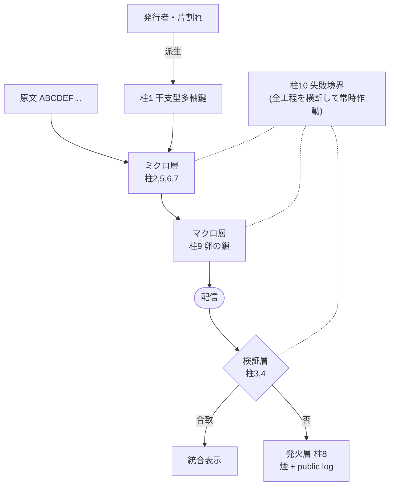

<!--
  human cord 構想白書 v0.2(日本語版・成果物)
  ソース原稿: Phase 0 Task #6 草稿(§1〜6 文体仕上げ済)
  本ファイルは外部レビュアー向け配布物。内部メモへの相互参照は除去済。
-->

# human cord

### 嘘では逃げられない情報インフラ
#### A Cryptographic Infrastructure for Documentary Integrity in the AI Era

|  |  |
|---|---|
| **バージョン** | v0.2(preliminary draft) |
| **発行日** | 2026-05-29 |
| **著者** | JUNJI MIZUMA |
| **位置付け** | 個人プロジェクト(無所属。いかなる法人・団体にも帰属しない) |
| **ステータス** | Phase 0(設計文書化)完了 / Phase 1(最小 POC)10 柱すべてに実装到達 / Phase 2(物理層)柱7 プロトコル層に着手 |
| **連絡先** | midorien.hita@gmail.com |
| **ライセンス** | 本文: Creative Commons Attribution-ShareAlike 4.0 International(CC BY-SA 4.0) 関連コード: Apache License, Version 2.0 |

---

## 1. 概要 / Abstract

生成 AI の能力向上にともない、公的書類や証明書を外見的に複製するコストは急激に低下しつつある。EUF-CMA を満たす電子署名は「発行者の秘密なしに有効な署名を作れない」という偽造不可能性を既に達成しており、改ざんも検知できる。本白書が埋めようとするのは、その先に残る空白である——すなわち (a) その保証を**別添の署名ではなく文書本体・物理媒体に不可分に保持**すること、(b) **本体を秘匿したまま発行者だけが真贋を判定する**媒介検証(公開鍵による公開検証と併用可能)、(c) 公開鍵署名単体では提供できない固有機能(秘匿突き合わせ・閾値発行・物理担体)である。本白書が提案する human cord は、この空白を埋めるための統合的な暗号インフラの構想である。

human cord は **10 本の柱**を、(i) マクロ層(卵の鎖)、(ii) ミクロ層(卵の中身)、(iii) 鍵派生層、(iv) 検証層、(v) 発火応答層、(vi) 失敗境界横断レイヤ、の **5 領域 + 1 横断**として統合する。各柱は単独では既存の研究・標準に強く接続しており、車輪の再発明を避けつつ、組み合わせ方の独自性として三つの主要な新規性(いずれも構想レベルの主張であり、現行 POC は最小実装段階にある)を提示する。第一に、文書レベルへ拡張された Subliminal Channel(柱 6。現 POC は発行者鍵由来の独立した authenticated フィールドによる最小実装で、真の subliminal channel は将来課題)。第二に、失敗境界における型と秘密の分離を徹底する自己観測抵抗(柱 10)。第三に、割符演算 `+/−` を**一つの演算子代数として統合し、検証失敗時に自動分岐する設計フレーム**(柱 3。BLS 集約署名等の機構は差し替え可能な境界として設計し、現 POC は依存ゼロの HMAC で割符性を最小実装)である。

中長期の標準化目標として、ISO/IEC 18033(暗号アルゴリズム)、ISO/IEC 27002 附属書(管理策)、および IETF RFC(IRTF CFRG 経由)を視野に入れる。本書執筆時点では Phase 0(設計の文書化)を完了し、Phase 1(Node.js による最小 POC)では 10 本の柱すべてに実装が到達している。

---

## 2. 動機:なぜ人間ではなく仕組みが守るのか

### 2.1 解こうとする問題

公的書類・証明書の外見は、大規模言語モデルと画像生成モデルの組み合わせによって容易に複製可能となりつつある。EUF-CMA 署名は「発行者の秘密なしに有効署名を作れない」ことを既に保証するが、その署名は文書とは**別添(detached)**であり剥離・差し替えが可能で、かつ公開鍵と発行者の同一性の束縛を PKI の運用に依存する。本書が目指すのは、その保証を文書本体・物理媒体に**不可分(intrinsic)**に保持し、さらに本体を秘匿したまま発行者だけが真贋を判定できる**秘匿検証**を、公開鍵による**公開検証**と併せて提供することである。ブロックチェーンは公開記録の改ざん耐性には強いが、文書そのものの内部に発行者性を埋め込む技術ではなく、両者は補完関係にあるべきである。

### 2.2 プロジェクト憲法(三原則)

human cord は、技術設計に先立つ三つの原則を憲法として持つ。第一に、**嘘では逃げられない仕組み**を作ること。改ざんを未然に防ぐより、改ざんが行われた瞬間に痕跡が残り続けることを優先する。第二に、**権利を主張するのではなく、ルールが守られる状態**を作ること。アクセス制限・コピー防止・自動通報といった「権利主張型」の機構ではなく、真贋判定が誰にでも可能な「ルール遵守型」のインフラを目指す。第三に、**AI は AI、人は人**として、戦わずそれぞれの役目を果たすこと。

### 2.3 第四条:技術・法・倫理の分離

技術は真実を保存する役目に専念し、悪意を罰する役目は法に、正しさを選ぶ役目は倫理にそれぞれ委ねる。human cord は煙を立てるだけであり、その煙を見て裁くのは人間と法の領域である。技術が法や倫理を**置き換えてはならない**点を、本プロジェクトの設計判断の前提として明示する。

### 2.4 既存対策が解けていない三つの隙間

第一に、署名が文書とは別添で剥離・差し替えが可能であり、保証を文書本体・物理媒体に不可分に保持できない点、また発行者性が公開鍵の同一性束縛(PKI の運用)に依存する点。第二に、印刷・スキャン・写真撮影といったメディアのラウンドトリップで暗号的な証拠が失われる点。第三に、失敗時に内部構造が露出してしまう点(side-channel attack / fault attack に対する系統的な対抗策の欠如)。本書で提示する 10 本の柱は、これら三つの隙間をそれぞれ柱 4・柱 7・柱 10 で正面から扱う設計となっている。

### 2.5 脅威モデル・攻撃者能力・信頼境界

本書が想定する攻撃者は、文書の外見を完全に複製でき(生成 AI)、通信を観測・記録・再提示でき、印刷・撮影・スキャンといった物理媒体を介在できる。ただし**発行者の秘密(対称コードブックの片割れ・公開鍵層の署名秘密)は保持しない**——これが信頼の根である。

信頼境界は二つのモードで異なる。**発行者媒介検証(§3.4(i))は「発行者の秘密を保持する主体(サーバ)」を信頼前提とする中央集権モデル**であり、真贋判定はその秘密保持者に依存する。一方**公開検証(§3.4(ii), Ed25519)は検証自体がサーバ非依存**だが、発行者公開鍵の**真正な配布(鍵の信頼)**は本書の対象外であり、証明書チェーンや鍵透明性ログ等で別途担保する必要がある。

鍵漏洩時の影響を明示する。発行者秘密が漏れれば対称コアの発行者媒介検証は全面的に破られ(攻撃者が正規に見える cord を生成可能)、公開鍵層の署名秘密が漏れれば公開検証用の attestation を偽造できる。ただし鍵前進(柱5)により、現在状態が漏れても過去発行分の遡及解読は防がれる(前方秘匿)。秘密が常に発行者の片割れに留まり続けることが全体の前提である。

正直な簡約として補足する。柱1 の多軸鍵は本質的に「公開ソルト + 秘密 IKM の HKDF ドメイン分離」に簡約でき、干支・時計といった「多軸」意味論は検証再現のための公開 nonce/salt に過ぎない(命名上の比喩)。柱5 の ratchet はストリーム/セッション向けの概念であり、証明書 1 通への適用は前方秘匿の保険であってオーバーキルになり得る。

### 2.6 既知の限界 / Non-goals

**Non-goals.** 技術は「煙を立てる」(改ざんの痕跡を残す)ことに専念し、アクセス制限・コピー防止・自動通報・悪意の処罰は扱わない(§2.3)。発行者公開鍵の真正な配布(PKI / 鍵透明性)、および物理媒体の実機ラウンドトリップ性能の保証も本書の射程外である。

**既知の限界(POC 段階).**

- 現行 POC は依存ゼロの最小実装である。柱3 の割符は HMAC 通行手形(BLS 集約署名ではない)、柱4b の閾値発行は Shamir で分散保管し発行時に k 片を集めて秘密を**一度復元してから seal** する方式(各片が再構成せず部分署名する真の閾値署名 BLS/FROST とは安全性質が異なる)、柱6 は発行者鍵由来の独立 authenticated フィールド(厳密な subliminal channel ではない)。いずれも差し替え可能な機構境界として設計した将来課題である。
- 柱4 系の自作 GF(256)/Reed-Solomon(`shard.js`/`ecc.js`)および割符の自前実装は機能的正しさを検証済みだが、**定時間性・サイドチャネル耐性は未保証・外部監査未了**であり、本番採用時は定時間実装/監査済ライブラリへの置換を要する。なお文書機密を担う対称コア(AEAD・鍵派生・公開鍵署名)は標準ライブラリ(node 標準 crypto)を用いており、この留保の対象外である。
- 柱7 の物理担体は合成光学劣化モデル(ぼけ・露出・ノイズ・遮蔽・透視・回転・放射歪み)を経た復元を実証済みだが、**実カメラ・実印刷・実スキャンを経た復元率は未測定**である(継続課題)。
- 外部暗号査読・第三者評価・複数独立実装は未了(Phase 6)。**標準化は目標であって前提ではなく**、本書の主張は査読に耐えた範囲に限り段階的に進める。

---

## 3. アーキテクチャ概観

human cord のアーキテクチャは、伝送路上を流れる「卵の鎖」というメタファーで全体が捉えられる。各卵は標準的な認証付き暗号(AEAD)で封がされ、卵同士はハッシュチェーンで連結される(マクロ層)。各卵の中身は、目玉文字・風景・潜在的なノイズ・物理層信号といった複数のレイヤから構成される(ミクロ層)。これらに、鍵派生・検証・発火応答の三層が外側から重なり、最後に「失敗境界の自己観測抵抗」と呼ぶ横断的な振る舞い規約が全工程を縦に貫く。本章では領域ごとの役割を概観する。

### 3.1 5 領域 + 1 横断

| 領域 | 含む柱 | 役割 |
|---|---|---|
| **マクロ層**(卵の鎖) | 9 | 標準 AEAD の上に乗るキャリア |
| **ミクロ層**(卵の中身) | 2, 5, 6, 7 | 目玉文字置換 / 風景溶込み / 動く核 / 裏チャネル / 物理層信号 |
| **鍵派生層** | 1 | 干支型多軸鍵 = 時間(公開)× 発行者秘密(私的) |
| **検証層** | 3, 4 | 割符演算 `+/−` + 発行者の片割れ |
| **発火層** | 8 | 改ざん検知 → 煙 + public log |
| **失敗境界(横断)** | **10** | 全工程を縦に貫く。同期破れ検知 / 末端劣化 / 内部状態漏れ耐性 / 観測逃避 |

### 3.2 アーキテクチャ図

図 1 にデータフローの簡略図を示す(レンダリング版は `docs/figures/architecture.ja.svg`)。

### 3.3 10 柱一覧

| # | 柱 | 一行要約 |
|---|---|---|
| 1 | 干支型多軸鍵生成 | 時間+秘密で瞬間専用コードブック |
| 2 | 風景溶込み | 目玉文字だけ置換、他は素通し |
| 3 | 割符演算 | `+` 統合 / `−` 差分発火 |
| 4 | 発行者の片割れ | 発行者秘密がないと復号・発行者媒介検証は不能(公開鍵での第三者検証は §3.4(ii) で別途可能)|
| 5 | 生きた演算子 | 内部状態が ratchet で動き続ける |
| 6 | 潜在チャネル | 目玉のノイズ、発行者だけが復号 |
| 7 | 物理層クロスモーダル信号 | スマホセンサ/カメラで検出可能、印刷耐性 |
| 8 | 能動的発火応答 | 改ざん検知で「煙」を立てる |
| 9 | 卵流アーキテクチャ | AEAD + ハッシュチェーン |
| 10 | 失敗境界の自己観測抵抗 | 横断。割れても型のみ、秘密は出ない |

### 3.4 検証の二層:発行者媒介検証 + 公開検証

human cord は二つの検証モードを併せ持つ。

- **(i) 発行者媒介検証(対称コア)**: 柱9 卵(AEAD)+ 柱4 発行者秘密。発行者だけが復号・検証でき、本体を隠したまま改ざんを検知する。発行者だけが読む裏チャネル(柱6)もこの層に属する。
- **(ii) 公開検証(公開鍵層, Ed25519 / RFC 8032)**: 発行者が「公開してよい事実」に署名し、**誰でも発行者の公開鍵だけでオフライン検証できる**(発行者秘密は不要)。証明書のように「事実は公開・真贋は第三者が確認する」場面に用いる。

両モードは併用でき、一度の発行で「隠す・読むのは発行者/真贋は誰でも」を同時に成立させられる。公開検証はブラウザの Web Crypto でも同一に動作するため、**サーバを介さない静的な検証ページ**で第三者検証が完結する。この二層構成により、機密保持(発行者媒介)と公共的な真贋確認(公開検証)という相反しがちな要件を、用途に応じて選択・併用できる。

### 3.5 標準化に向けた階層化:コアと拡張

10 柱は設計の全体像を概念として捉えるための地図であるが、標準化・実装の観点では均一ではない。各柱を「脅威 → 機構 → 性質」の三項で棚卸しすると、保証の所在と成熟度に応じて次の四層に整理できる。この階層化は、標準化を「全 10 柱の一括採択」ではなく **最小核 → 公開検証 → 拡張** という段階的プロセスとして現実的に定義するためのものである(§6.2)。

| 層 | 含む柱 | 位置づけ |
|---|---|---|
| **(I) 対称発行コア(最小核)** | 1 鍵派生 + 9 AEAD 鎖 + 5 鍵前進 + 10 最小開示 | 分離不能な一つの seal/open コアを成す(`cord.js`/`egg.js`)。標準化はまずこの最小核を対象とする |
| **(II) 公開検証層** | 4 のうち公開鍵層(Ed25519 / RFC 8032) | 長期・公開・反復検証される文書(証明書等)の本命。§3.4(ii) |
| **(III) 固有価値(コアの拡張)** | 3 秘匿突き合わせ / 4 閾値発行(Shamir)/ 7 担体 codec(Reed-Solomon 物理輸送) | 公開鍵署名単体では提供できない差別化機能 |
| **(IV) 将来拡張・横断原則・運用規約** | 4 Fuzzy Extractor・6 Subliminal・7 リプレイ防止(用途依存の将来拡張)/ 10(全工程に課す設計原則=独立機能でなく不変条件)/ 8 煙(tamper-evident 監査ログへの記録=採用先の既存監査基盤に吸収しうる運用規約)/ 2 風景溶込み(検証非依存の表示レイヤ) | 用途・成熟度に応じて段階的に標準化・実装する |

> **注(閾値発行の実装状況):** 層 (III) の閾値発行は二層に分かれる。**(a) 対称担体の分散保管**は Shamir 秘密分散で発行者秘密を分散保管し、発行時に k 片を集めて**秘密を一度復元してから seal** する方式で、復元を行う一点に完全な秘密が一時的に顕在化する(対称鍵で seal する以上これは不可避)。**(b) 公開 attestation の閾値署名**は、各片が秘密を再構成せず部分署名する**真の閾値署名(素数体上の FROST 系しきい値 Schnorr・依存ゼロ)を POC 実装済み**(`src/threshold.js`)で、署名のどの瞬間にも完全な秘密は顕在化せず、検証は公開鍵だけでオフラインに行える。ただし本実装は単一 nonce のため**逐次・非並行セッション専用**であり、並行対応(FROST の二重 nonce バインディング)・分散鍵生成(DKG)・不正者特定(VSS)は将来課題である。BLS による集約署名版も将来。

ここで重要なのは、層 (I)〜(III) が **実質的な仕様の核(おおむね 5 機能)** を成し、層 (IV) は「将来の拡張」「全体に課す設計原則」「運用規約」「表示レイヤ」へと役割が分かれるという点である。これは 10 柱を削るのではなく、**標準仕様として記述する順序と粒度を明確化する**ものであり、概念地図としての 10 柱(付録 A の比喩 ↔ 暗号工学対応表)はそのまま保たれる。

---

## 4. 主要新規性

### 4.1 柱 6:文書レベルへ拡張された Subliminal Channel

Subliminal Channel(潜在チャネル)の概念は、Gustavus Simmons が CRYPTO '83 で提唱したものであり、電子署名の内部に、署名者だけが読み出せる第二のメッセージを埋め込むことを可能にする [1]。検証者には署名は通常通りに見え、特定の鍵保持者のみが裏のメッセージを復号できる。学術的な研究蓄積は豊富で、Bitcoin の ECDSA における subliminal channel の存在も近年指摘されているが、**実用化された標準は現時点では存在しない**。

human cord はこの概念を単発の電子署名から**文書全体のレベル**へとスケールアップすることを構想する。目玉文字(柱 2 で導入する選択的に置換された文字)に付随する微小なノイズが文書全体で集積し、発行者だけが復号できる「裏文書」を構成する——というのが設計上の到達目標である。検証者の目には通常の証明書として表示される一方、発行者は裏チャネルを読み出すことで「これは確かに自分が発行したものである」という判定を内部的に下せる。

**実装上の留保(重要)**: 現行 POC は、この裏文書を目玉文字へステガノグラフィ的に埋め込むのではなく、cord に付随する**独立した authenticated フィールド**(発行者鍵由来の keystream による XOR + HMAC)に格納する最小実装にとどまる。目玉文字(柱 2)への真の埋め込み、および検証鍵と裏チャネル鍵の完全分離は将来課題である。したがって本柱の現状は、署名の自由度に秘密を埋める Simmons の構成という厳密な意味での subliminal channel ではなく、**発行者のみが読める authenticated 付帯チャネル**であると正直に位置づける。

本柱の意義は、AI による外見の完全な複製が成立しても、裏チャネル自体は発行者秘密がなければ生成不能であるという点にある。つまり、視覚的な真贋判定が AI 時代において信頼性を失っていく状況に対し、**目に見えない層で発行者性を保持する**ことを可能にする。

**運用上の位置づけ(重要な留保)**: 潜在チャネル(隠れチャネル)は、監査・標準化の文脈では、しばしば「検出・排除すべき対象」として警戒される性質を併せ持つ。したがって本柱は**検証可能なコア(§3.5 層 (I)〜(III))には含めず、用途を限定した将来拡張(層 (IV))として隔離する**。発行者媒介検証(§3.4(i))および公開検証(§3.4(ii))は本柱に一切依存しない。採用に際しては、隠れチャネルの存在自体が許容される用途かを個別に判断すべきであり、許容されない環境では本柱を無効化したまま運用できる(コアの安全性は変わらない)。

### 4.2 柱 10:失敗境界の自己観測抵抗

暗号システムにおける最大の脆弱性は、しばしば「失敗時」に現れる。fault attack、side-channel attack、downgrade attack といった既知の攻撃群は、いずれもシステムが正常動作から逸脱した瞬間に内部構造が露出する点を突くものである。本柱は、こうした失敗境界における露出を体系的に統制するための横断的な設計原則として導入される。

設計原則は次の一文に集約される。**割れたときに露出するのは「型」だけであり、秘密(発行者鍵および動的な内部状態の現在値)は割れても出ない**。ここで「型」とは Kerckhoffs の原則が公開を前提とする部分であり、具体的には用いられる代数構造・プロトコル識別子・データの参照構造などを指す。これらは公開されても安全性を損なわないが、秘密は常に発行者の片割れに留まり続けなければならない。

本柱は、以下の四つのサブ機能を統合的に束ねる。

| サブ機能 | 内容 | 対応既存技術 |
|---|---|---|
| 同期破れ検知 | seq # / nonce のずれを早期に検知 | TLS 1.3 record sequence, QUIC packet number |
| 制御された末端劣化 | back-pressure による末端からの段階的退避 | TCP flow control, reactive streams |
| 内部状態漏れ耐性 | 割れても核の現在状態は出ない | Side-channel masking, fault-injection countermeasures |
| 観測逃避表現 | screenshot/OCR で同一パターンが二度取れない | Moving-target defense |

既存の fault tolerance、side-channel countermeasures、ratchet 研究はそれぞれ独立した蓄積を持つが、これらを一つの設計原則で束ねるフレームは類例が少ない。本柱の独自性は、Kerckhoffs 原則の「型と秘密の分離」を、**失敗境界という具体的な操作可能な場面**で実装規約として明文化した点にある。

### 4.3 柱 3:割符演算 `+/−` における失敗時自動分岐

電子署名の集約や複数証明書の関係性検証については、BLS Aggregate Signature(Boneh-Lynn-Shacham, 2004)[2]、Cryptographic Accumulator、W3C Verifiable Credentials の Presentation 機構、Myers diff、Merkle DAG diff など、多数の既存技術が存在する。これらはそれぞれ独立した目的で発展してきたが、業務上の真贋判定 UX という観点では、必ずしも統合的に提供されていない。

human cord は、これらを**一つの演算子代数として統合する設計フレーム**を提示する。具体的には、`+` 演算が BLS 集約・Accumulator のメンバーシップ証明・VC Presentation を同一の操作として表現する設計とし、`−` 演算は `+` の失敗時に自動的にフォールバックする差分提示モードとして定義される。**演算が失敗した場合にエラーを返すのではなく、別の有用な情報(差分単文)を返す**という設計は、暗号プロトコルとしては珍しい部類に属する。なお現行 POC はこの代数を**依存ゼロの HMAC 通行手形(docId + 発行者秘密)で最小実装**しており、BLS 集約署名による実体化は差し替え可能な機構境界として設計した将来課題である。本書が主張するのはこの**演算子代数としての設計フレームの新規性**であって、BLS による実証ではない。

本柱の業務上の意義は明確である。ISMS 監査において従来は「単発の署名が検証可能か」という二値判定にとどまっていたものが、「**複数の証明書の関係性まで検証可能**」な記述能力へと拡張される。実務 UX としては、検証者は常に「合致して統合された 1 枚」または「差分が明示された比較表示」のいずれかを得ることになり、判定不能という状態が原理的に発生しない。

### 4.4 柱 7:物理層クロスモーダル信号(視覚チャネル)

印刷・スキャン・写真撮影といったメディアのラウンドトリップに耐える暗号信号という研究領域は、EURion constellation、TEMPEST、Li-Fi 等の交差点に位置し、暗号工学の主流からは比較的若い領域である。実用化された標準は現時点では存在しない。

human cord はこの柱について、Phase 2 で**プロトコル層の最小実装**に着手した。設計上の要点は二つである。第一に、保証の所在を明確に分離する——**スマホの AI 画像解析は「目」(歪み・光・部分欠損に対する頑健性)を担い、暗号的保証(真正性・改ざん検知・新鮮性)は cord 側が担う**。AI の高度化は保証を肩代わりしない。第二に、**光チャネル自体はリプレイ攻撃を防げない**(画面を撮った画像は再表示・再撮影で複製できる)という事実を前提に、リプレイ防止を「チャネル」ではなく「プロトコル」へ置く。具体的には、発行ごとに一意な nonce(鎖先端ハッシュ)の一回性検証と、公開時刻軸に基づく鮮度窓、改ざん・再提示の検知時に立つ「煙」(柱 8)を組み合わせる。

この縦切りは BiosGuide における証明書発行という具体的な業務フィールドで最初の応用例を得る見込みであり、実ピクセル描画・誤り訂正符号・カメラ/AI 抽出といった物理アダプタは継続課題として残る。

---

## 5. 既存研究との接続

human cord の各柱は、いずれも既存の暗号研究・標準・実装に強い接続を持つ。新規性は個別技術の発明ではなく、組み合わせ方とその上に被せる横断的な設計原則にある。本章では、車輪の再発明を避けるために行った既存研究のマッピングと、上位研究領域への位置づけを示す。

### 5.1 10 柱 × 既存技術 マトリクス(圧縮版)

| 柱 | 主要既存技術 | 標準化状況 |
|---|---|---|
| 1 干支型多軸鍵 | KDF / HKDF / ChaCha | NIST SP 800-108 / RFC 5869 |
| 2 風景溶込み | FPE / Steganography | NIST SP 800-38G(FPE) |
| 3 割符演算 | BLS Aggregate Sig / Accumulator / VC | IETF draft-irtf-cfrg-bls-signature |
| 4 発行者の片割れ | PKI X.509 / Threshold Sig / Shamir SS | RFC 5280 / ISO/IEC 11770 |
| 5 生きた演算子 | Signal Double Ratchet / Sponge | IRTF CFRG / Signal spec |
| 6 潜在チャネル | **Simmons Subliminal Channel(1983)** | (標準化空白) |
| 7 物理層信号 | Physical-Layer Security / EURion / Li-Fi | IEEE 1900 series / 802.15.7 |
| 8 発火応答 | Cryptographic Tripwire / HSM tamper / 透明性ログ | FIPS 140-3 L4 / RFC 6962 |
| 9 卵流アーキ | AES-GCM / ChaCha20-Poly1305 / TLS 1.3 | RFC 8446 / NIST SP 800-38D |
| 10 失敗境界 | Side-channel countermeasures / MTD | (横断的、統合標準なし) |

### 5.2 上位研究領域への位置づけ

human cord 全体は、**Moving Target Defense (MTD) Cryptography** という現役研究領域の一つの実装として位置付けることができる。MTD は、DARPA Moving Target program(2010 年〜)や NIST SP 800-160 Vol. 2(Systems Security Engineering)を中心に研究蓄積が進められているが、2026 年現在において汎用的な標準は未だ確立されていない。本書は、human cord をこの空白に対する標準提案候補として位置付ける。

### 5.3 既存 vs 新規 の明示

新規性の主張範囲を明示するため、各柱の貢献区分を以下に整理する。柱 1・4・9 は既存技術をそのまま採用しており、新規性は主張しない(車輪の再発明回避)。柱 2・5・7・8 は既存技術からの派生・拡張に位置する。柱 3・6・10 においては相応の新規貢献余地があり、本書 §4 で詳述した通りである。そして、10 本の柱を 5 領域 + 1 横断として一枚の設計図に繋ぐ統合フレームそのものを、本書のもう一つの貢献として提示する。

---

## 6. ロードマップと現状

human cord プロジェクトは、設計の文書化から標準化に至るまで 6 つのフェーズで構成される。各フェーズは独立した出口成果物を持ち、段階的に検証可能な形で進められる。本章では全体ロードマップと、最終目的地である国際標準化に至る複数のターゲット規格を示す。

### 6.1 6 フェーズロードマップ

| Phase | 出口 | 状態 |
|---|---|---|
| 0 土台を文書化 | 夢ログ集 + 魂メモ + アーキテクチャ図 + サーベイ + 本白書 | **完了** |
| 1 Node.js 最小 POC | 動く human cord 最小版 | **10 柱 + 公開鍵層(Ed25519)+ 採用面 API、依存ゼロ、テスト 119 件** |
| 2 物理層への拡張 | 印刷・撮影で生き残る human cord | **着手(柱7 視覚/音響 2 担体 + RS 誤り訂正、物理アダプタ継続)** |
| 3 構想白書 v0.2 | 日英 5 ページ仕様書 | 本書 = 仕上げ中 |
| 4 BiosGuide 統合 | 証明書発行 + 監査ログに組込 | **設計・採用面・統合ドラフト着手(本番適用は別)** |
| 5 Blancco アプローチ | 技術担当との対話開始 | 未着手 |
| 6 標準化 | IACR ePrint → SCIS → 国際学会 → IETF/NIST → ISO/IEC | 未着手 |

### 6.2 標準化ターゲット

| ターゲット規格 | 層(§3.5) | 該当する柱 | 着地時期目安 |
|---|---|---|---|
| IETF RFC(IRTF CFRG 経由) | (I) 対称発行コア | 柱 1 鍵派生 + 5 鍵前進 + 9 AEAD 鎖(+ 柱 10 設計原則) | 2〜4 年 |
| IETF RFC(既存標準のプロファイル化) | (II) 公開検証層 | 柱 4d 公開鍵(Ed25519 / RFC 8032) | 2〜4 年 |
| ISO/IEC 19772(認証付き暗号) | (I)+(III) | 柱 9 + 柱 3 秘匿突き合わせ | 3〜5 年 |
| ISO/IEC 18033(暗号アルゴリズム) | (III) | 柱 7 担体 codec(Reed-Solomon) | 5〜10 年 |
| ISO/IEC 29192(軽量暗号) | (III) | 物理担体の軽量プロファイル(BiosGuide IoT 応用) | 3〜7 年 |
| ISO/IEC 27002 附属書 | (IV) 運用規約 | 柱 8 監査ログ記録 + 全体運用ガイダンス | 3〜5 年 |

(柱 6 Subliminal・柱 4c Fuzzy Extractor は §3.5 層 (IV) の将来拡張であり、近接の標準化ターゲットには置かない。)

標準化は §3.5 の階層に沿って段階的に進める。すなわち、まず層 (I) 対称発行コア(柱 1/5/9/10)を最小核として CFRG に提案し、次に層 (II) 公開検証層(Ed25519 / RFC 8032 は既存標準のプロファイル化)、続いて層 (III) 固有価値(柱 3 / 4 閾値 / 7 担体)を拡張仕様として積む。層 (IV) は将来拡張・運用ガイダンス(ISO/IEC 27002 附属書)として後置する。

**最短ルート**: IRTF CFRG(層 I コア)→ IETF RFC → ISO 採用(層 III まで段階的に拡張)

---

## 7. 参考文献

1. Simmons, G. J. (1984). "The Prisoners' Problem and the Subliminal Channel." In *Advances in Cryptology: Proceedings of CRYPTO '83*, pp. 51–67. Plenum Press.
2. Boneh, D., Lynn, B., Shacham, H. (2004). "Short Signatures from the Weil Pairing." *Journal of Cryptology*, 17(4), 297–319.
3. Boneh, D., Gentry, C., Lynn, B., Shacham, H. (2003). "Aggregate and Verifiably Encrypted Signatures from Bilinear Maps." In *EUROCRYPT 2003*, LNCS 2656, pp. 416–432.
4. Shamir, A. (1979). "How to Share a Secret." *Communications of the ACM*, 22(11), 612–613.
5. Dodis, Y., Reyzin, L., Smith, A. (2004). "Fuzzy Extractors: How to Generate Strong Keys from Biometrics and Other Noisy Data." In *EUROCRYPT 2004*, LNCS 3027, pp. 523–540.
6. Bertoni, G., Daemen, J., Peeters, M., Van Assche, G. (2007). "Sponge Functions." *ECRYPT Hash Workshop 2007*.
7. Bernstein, D. J. (2008). "ChaCha, a Variant of Salsa20." *Workshop Record of SASC 2008*.
8. Marlinspike, M., Perrin, T. (2016). "The Double Ratchet Algorithm." Signal Technical Specification.
9. Kerckhoffs, A. (1883). "La cryptographie militaire." *Journal des sciences militaires*, IX, 5–38.
10. Camenisch, J., Lysyanskaya, A. (2002). "Dynamic Accumulators and Application to Efficient Revocation of Anonymous Credentials." In *CRYPTO 2002*, LNCS 2442, pp. 61–76.
11. Sporny, M., Longley, D., Chadwick, D. (2022). "Verifiable Credentials Data Model v1.1." W3C Recommendation.
12. Myers, E. W. (1986). "An O(ND) Difference Algorithm and Its Variations." *Algorithmica*, 1(1–4), 251–266.
13. Merkle, R. C. (1988). "A Digital Signature Based on a Conventional Encryption Function." In *CRYPTO '87*, LNCS 293, pp. 369–378.
14. Kocher, P., Jaffe, J., Jun, B. (1999). "Differential Power Analysis." In *CRYPTO '99*, LNCS 1666, pp. 388–397.
15. Boneh, D., DeMillo, R. A., Lipton, R. J. (2001). "On the Importance of Eliminating Errors in Cryptographic Computations." *Journal of Cryptology*, 14(2), 101–119.
16. Genkin, D., Shamir, A., Tromer, E. (2014). "RSA Key Extraction via Low-Bandwidth Acoustic Cryptanalysis." In *CRYPTO 2014*, LNCS 8616, pp. 444–461.
17. Pfitzmann, B., Waidner, M. (1992). "Attacks on Protocols for Server-Aided RSA Computation." In *EUROCRYPT '92*, LNCS 658.
18. NIST (2007). *SP 800-38D: Recommendation for Block Cipher Modes of Operation: Galois/Counter Mode (GCM) and GMAC*.
19. NIST (2016). *SP 800-38G: Recommendation for Block Cipher Modes of Operation: Methods for Format-Preserving Encryption*.
20. NIST (2008/2022). *SP 800-108 Rev.1: Recommendation for Key Derivation Using Pseudorandom Functions*.
21. NIST (2018). *SP 800-160 Vol. 2: Developing Cyber-Resilient Systems — A Systems Security Engineering Approach*.
22. NIST (2019). *FIPS 140-3: Security Requirements for Cryptographic Modules*.
23. IETF (2010). *RFC 5869: HMAC-based Extract-and-Expand Key Derivation Function (HKDF)*.
24. IETF (2008). *RFC 5280: Internet X.509 Public Key Infrastructure Certificate and CRL Profile*.
25. IETF (2018). *RFC 8446: The Transport Layer Security (TLS) Protocol Version 1.3*.
26. IETF (2018). *RFC 8439: ChaCha20 and Poly1305 for IETF Protocols*.
27. IETF (2013). *RFC 6962: Certificate Transparency*.
28. ISO/IEC (2021). *ISO/IEC 18033-1:2021: Information security — Encryption algorithms — Part 1: General*.
29. ISO/IEC (2012). *ISO/IEC 29192-1:2012: Information technology — Security techniques — Lightweight cryptography — Part 1: General*.
30. ISO/IEC (2020). *ISO/IEC 19772:2020: Information security — Authenticated encryption*.
31. ISO/IEC (2010). *ISO/IEC 11770-1:2010: Information technology — Security techniques — Key management — Part 1: Framework*.
32. ISO/IEC (2022). *ISO/IEC 27002:2022: Information security, cybersecurity and privacy protection — Information security controls*.
33. IEEE (2018). *IEEE 802.15.7-2018: Short-Range Optical Wireless Communications*.
34. Haas, H., Yin, L., Wang, Y., Chen, C. (2016). "What is LiFi?" *Journal of Lightwave Technology*, 34(6), 1533–1544.
35. Mukhopadhyay, D., Chakraborty, R. S. (2014). *Hardware Security: Design, Threats, and Safeguards*. CRC Press.

> 注: 各エントリは公知の規格・論文に基づくが、版数・発行年は配布前に最終照合する。Phase 3 完了時に 35→40 件規模へ追補予定。

---

## 付録 A: 用語対応表(比喩 ↔ 暗号工学)

| 比喩(human cord) | 暗号工学 |
|---|---|
| 卵 | AEAD record / sealed box |
| 卵の鎖 | hash-linked record stream |
| 卵の核 | stateful operator (ratchet) |
| 目玉文字 | selectively format-preserved substituted character |
| 目玉のノイズ | subliminal channel payload |
| 風景溶込み | non-substituted plaintext context |
| 干支型多軸 | multi-dimensional KDF input |
| 通行手形 | issuer-specific verification key |
| 割符 | issuer's private half (cf. PKI private key) |
| 煙 | tamper-evident broadcast signal |
| 片割れ | private half of an asymmetric pair |
| 失敗境界 | failure-mode operational boundary |
| リズム狂い | seq # / nonce desync |
| 末端の卵が落ちる | back-pressure-induced graceful degradation |

---

## 履歴

- 2026-05-28 Phase 0 Task #6 として日本語版を作成、§1〜6 を白書文体に仕上げ。
- 2026-05-29 外部配布物として `docs/` に確定版を起こす。表紙確定要素を充足(著者名・連絡先は Phase 3 公開直前挿入のプレースホルダ、その他は確定)、ステータスを現況に更新、§4.4 柱7 を Phase 2 プロトコル層 POC として昇格、アーキテクチャ図を Mermaid 化、参考文献を 12→35 件に増強。
- 2026-05-30 §3.4「検証の二層(発行者媒介 + 公開検証)」を追加(柱4 公開鍵層 Ed25519 = 公開鍵だけでオフライン第三者検証、Web Crypto 相互運用済 = サーバレス検証ページ成立)。§6.1 ロードマップを現況に更新(公開鍵層・採用面 API・テスト 119 件、Phase 4 設計/ドラフト着手)。
- 2026-05-30 §3.5「標準化に向けた階層化:コアと拡張」を追加。10 柱を脅威→機構→性質で棚卸しし、(I) 対称発行コア / (II) 公開検証層 / (III) 固有価値 / (IV) 将来拡張・横断原則・運用規約 の四層に整理(実質的な仕様の核はおおむね 5 機能)。§6.2 標準化ターゲットを階層に沿った段階的プロセスとして明示(10 柱の概念地図=付録 A は保持)。
- 2026-05-31 §4.1 に柱 6(潜在チャネル)の「運用上の位置づけ(重要な留保)」を追記。隠れチャネルは監査・標準化で警戒される性質を持つため、検証可能なコア(§3.5 層 I〜III)から隔離し将来拡張(層 IV)として位置づけ、無効化したまま運用可能であること(コアの安全性は不変)を明示。
- 2026-06-07 公開準備レビュー(多エージェント検証)を反映し HIGH 項目を修正。著者名・連絡先を確定。実装と主張の乖離に留保を追加(§1・§4.1 柱6=独立 authenticated フィールド/§4.3 柱3=HMAC 最小実装・BLS は将来/§3.5 注=Shamir は秘密復元 seal で真の閾値署名でない)。§2.5「脅威モデル・攻撃者能力・信頼境界」と §2.6「既知の限界 / Non-goals」を新設。動機(§1・§2.1・§2.4)を EUF-CMA 署名を踏まえ detached vs intrinsic / 公開検証 vs 秘匿検証へ再定式化。§3.3 柱4 一行要約を §3.4 二層検証と整合(公開検証は秘密不要)。§6.2 標準化表を §3.5 四層軸に再構築(柱6・柱8 を IETF RFC 早期ターゲットから除外)。コード変更なし。
